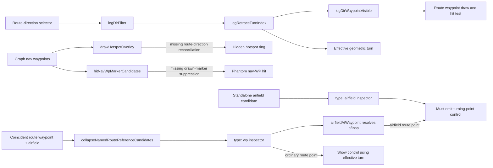

# Investigation Report

**Ticket**: n/a
**Service(s)**: NavAid static web app
**Environment**: local
**Bug surface**: frontend
**Tier**: lean
**Confidence**: HIGH

## Root Cause

The direction slice is correctly enforced for route waypoint discs and their direct hit targets. `drawHotspotOverlay()` bypasses it and iterates every graph hotspot without checking whether the coincident route waypoint is hidden (`docs/app/draw.js:5426-5432`). `hitNavWpMarkerCandidates()` also exposes a navigation reference when every matching route waypoint is hidden (`docs/app/interact.js:398-408`). Consequently a hidden outbound hotspot can leave both a review-overlay ring and a phantom navigation-reference hit in the return-only view.

The route geometry already derives the effective turn as the start of the first retraced leg (`docs/app/core.js:4517-4531`). The route-waypoint inspector marks its control selected only from the serialized `wp.turn` override (`docs/app/interact.js:3000-3008`). The same route-waypoint branch resolves `afInsp = airfieldAtWaypoint(wp)` at `docs/app/interact.js:2866-2869`, yet appends the turning-point button unconditionally. Per the corrected requirement, `afInsp` is the intended exclusion predicate. Ordinary non-airfield route waypoints may show the control; a route waypoint resolving to an airfield must not. Standalone `type:'airfield'` inspection already omits it.

## Evidence Chain

| Layer | File | Finding |
|-------|------|---------|
| Direction state / business logic | `docs/app/core.js:4487-4574` | `legIsRetrace()` and `legRetraceTurnIndex()` correctly identify a waypoint whose outgoing leg reverses an earlier leg; `legDirWaypointVisible()` correctly partitions waypoint indexes around that turn. |
| Route rendering | `docs/app/draw.js:4388-4415` | Route waypoint discs and hotspot rings share `legDirWaypointVisible()`, so this primary path is correct. |
| Hotspot reference rendering — **ROOT CAUSE** | `docs/app/draw.js:5414-5455` | The `?hotspots=1` projection loops over every `navWP` hotspot and paints its ring without reconciling graph points with the selected route-direction slice. |
| Reference interaction — **ROOT CAUSE** | `docs/app/interact.js:398-408` | Navigation-reference hit testing does not suppress a candidate whose matching route occurrences are all hidden. Visible overlaps must remain candidates so the chooser can merge their metadata into the route waypoint. |
| Turning-point inspector — **ROOT CAUSE** | `docs/app/interact.js:2865-3017` | The route-waypoint branch already computes `afInsp`, but appends the turning-point control for both ordinary route points and route points at airfields; its selected state also reads only `wp.turn` instead of the effective derived index. |
| Standalone airfield inspector | `docs/app/interact.js:2811-2823` | A standalone `type:'airfield'` inspector already has no turn control. No change to this branch is needed. |
| Overlap chooser identity | `docs/app/interact.js:578-603` | When a named route waypoint and an airfield coincide, the chooser removes the separate airfield candidate, annotates the route candidate with `mergedReference`, and deliberately keeps the route object. |
| Selection normalization | `docs/app/interact.js:605-613` | Selecting that merged row stores only `{type:'wp', index}`. Therefore selection type alone cannot identify the user-reported route-airfield case; the inspector must use its resolved `afInsp`. |
| Airfield resolution | `docs/app/draw.js:2490-2500` | `airfieldAtWaypoint()` first matches the route waypoint's ICAO name, then falls back to ARP proximity, covering named/coincident and legacy-renamed route-airfield points. This is the existing reliable domain predicate. |
| Existing chooser regression | `tests/routes.spec.js:473-509` | The LLHA overlap case proves the merged “Route waypoint / Airfield / Haifa” row resolves to `{type:'wp', index:10}` and therefore reaches the route-waypoint branch where `afInsp` must suppress the control. |
| Local runtime evidence | `http://127.0.0.1:8127/?lang=en&nogist` | Direct LLHA selection produced `{type:'airfield'}` with no `#insp-turn-btn`. Feeding coincident `{type:'wp'}` and `{type:'airfield'}` candidates through `showPointChoice()` produced `{type:'wp'}` with `airfieldAtWaypoint(wp)` resolving LLHA and `#insp-turn-btn` still present. That present button is the corrected user-reported defect. |

## Data Flow

## Affected Files

- `docs/app/draw.js:5414-5455` — hotspot review-overlay rendering must suppress a graph hotspot when its coincident route occurrence belongs only to the hidden direction.
- `docs/app/interact.js:398-408` — suppress navigation-reference and airfield hit candidates when every matching route occurrence is hidden. Preserve candidates at visible overlaps so the chooser can enrich the editable route waypoint.
- `docs/app/interact.js:2811-3017` — leave the standalone airfield branch and route geometry unchanged. Append the turn control only when `afInsp` is null. For ordinary route points, derive selected state from the existing `legRetraceTurnIndex()` source of truth.
- `tests/leg-direction-filter.spec.js:147-196` — extend the new regression to pin the airfield exclusion boundary alongside hidden hotspot visuals/hits and derived-turn route-inspector state.
- `tests/routes.spec.js:473-509` — extend the existing merged-airfield chooser regression to assert that LLHA's route-enriched airfield inspector omits `#insp-turn-btn` despite the resulting selection remaining `type:'wp'`.

## Related Tests

- `tests/leg-direction-filter.spec.js:147-210` — the newly written red regression covers hidden hotspot projection/hits, a geometry-derived turn on an ordinary non-airfield `type:'wp'`, and the route-airfield exclusion boundary.
- `tests/leg-direction-filter.spec.js:558-570` — verifies the inspector after an explicit manual mark on a non-airfield route point; it does not exercise `afInsp`.
- `tests/hotspots-overlay.spec.js:26-63` — verifies the global graph hotspot count, layer independence, and explicit overrides without any route, turning point, or direction filter.
- `tests/routes.spec.js:473-510` — pins the merged chooser identity as `type:'wp'`, preserves the airfield-enriched title, and asserts that its inspector omits the unwanted turn control.
- `tests/ui-deep-coverage.spec.js:401-410` — confirms the separate standalone-airfield inspection path; it is not the failing case because that branch already omits the control.

## Test Gap

The added merged-airfield regression asserts:

- The chooser selects the editable route waypoint as `type:'wp'`.
- The inspector retains LLHA airfield enrichment.
- `#insp-turn-btn` is absent.

The direction-filter regression separately proves that an ordinary non-airfield geometric turn shows the selected control. Together they exercise the branch combination that the earlier standalone-airfield and ordinary-route tests missed.

## Tier

**Value**: lean
**Rationale**: The corrected feedback remains a bounded frontend fix. `afInsp` is already computed in the affected route-waypoint inspector and provides the required exclusion without changing route geometry or direction behavior.

## Architecture Impact

**Value**: `none`

## Confidence Notes

HIGH: The chooser, selection, and inspector paths are unambiguous. The local probe reproduces the unwanted button specifically on merged LLHA, and `airfieldAtWaypoint()`/`afInsp` is already the inspector's canonical name-or-position resolution for that route-airfield case.
