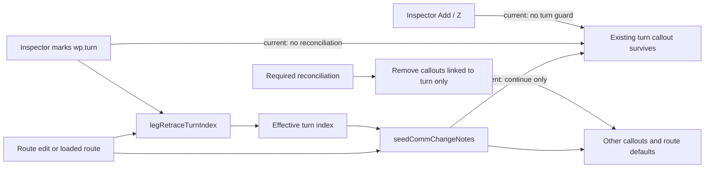

# Investigation Report

**Ticket**: #1799 — Remove frequency change at the turning waypoint  
**Service(s)**: NavAid static web app  
**Environment**: local source review at `origin/dev@1253522c35d123fad7992a3299770a494359dc5a`  
**Bug surface**: frontend  
**Tier**: lean  
**Confidence**: HIGH

## Root Cause

`seedCommChangeNotes()` already asks `legRetraceTurnIndex()` for the route's effective turning waypoint, so both a manually marked turn and a geometry-derived first retraced leg reach the same index. The defect is in what the seeder does with that index.

At `docs/app/draw.js:3744-3753`, the turning-point branch only skips creating an automatic callout. It deliberately lets an existing hand-created or hand-edited callout fall through to the normal `existing` branch, and an automatic callout that was seeded before the route acquired its return leg is not removed either: with no manual note the early `continue` prevents the later removal logic from seeing it. The current test at `tests/leg-direction-filter.spec.js:434-447` explicitly locks in the now-obsolete behavior that a hand-added note at the turn survives.

There is a second timing gap for manual turns. `setTurnWaypoint()` changes only waypoint flags (`docs/app/core.js:4550-4555`), and the inspector click handler does not reconcile communication callouts afterward (`docs/app/interact.js:3016-3023`). Therefore marking an existing route waypoint as the turn leaves its callout visible immediately. Geometry-derived turns usually reach `seedCommChangeNotes()` after route add/drag paths, but still hit the faulty skip logic above.

Finally, after removal the waypoint inspector and the `Z` shortcut can recreate a manual callout because `appendAddFreqChangeButton()` / `addCommChangeNoteForWaypoint()` do not know that the selected waypoint is the effective turn (`docs/app/interact.js:201-276`, `2924-2966`, `4291-4300`). That violates the issue's invariant that the effective turn carries neither an automatic nor a manual callout.

## Expected Behavior

- Resolve the effective turn exclusively through `legRetraceTurnIndex()`. Its existing precedence already covers both cases: the single persisted `wp.turn` wins, otherwise the start of the first retraced leg is the turn.
- Whenever callouts are reconciled, remove every `state.notes` entry whose canonical `cc` key belongs to the effective turning waypoint, regardless of `freqAuto` being `true`, `false`, or absent.
- Marking a waypoint through the turning-point inspector must perform that removal immediately, before repainting and persisting the resulting state.
- A turning waypoint must not offer or accept the manual “Add frequency change” action (button or `Z` shortcut). The published comm-change reference/badge may remain read-only; the prohibited object is the route's draggable note/callout.
- Turn-based removal is conditional route reconciliation, not a pilot suppression. Do not add the key to `state.commChangeSuppressions`; if the turn is later cleared or moved, normal seeding may restore the point's route-default callout.
- Preserve all unrelated communication-change notes and ordinary notes byte-for-byte. If the removed callout was selected, clear/reindex `state.selected` safely so it cannot point at a different note after the array changes.

## Evidence Chain

| Layer | File / function | Finding |
|---|---|---|
| Effective turn source | `docs/app/core.js:4531-4545`, `legRetraceTurnIndex()` | Manual `wp.turn` takes precedence; otherwise the first retraced leg yields its starting waypoint. This is already the correct shared definition for manual and derived turns. |
| Manual turn mutation | `docs/app/core.js:4550-4555`, `setTurnWaypoint()` | Sets/clears the single turn flag but does not reconcile callout notes. |
| Callout reconciliation — **root cause** | `docs/app/draw.js:3693-3829`, `seedCommChangeNotes()` | Computes `turnWpIdx`, but the turn branch only withholds a new automatic note. It preserves a manual note by design and fails to delete an already-seeded automatic note before continuing. |
| Existing note branch | `docs/app/draw.js:3754-3800` | Removes only an automatic note made redundant by an equal, explicitly hinted frequency. It is not reached for the auto-note-at-turn case and intentionally never removes manual notes. |
| Manual inspector action — **root cause** | `docs/app/interact.js:3000-3024` | The turn button calls `setTurnWaypoint()`, persists, and redraws without removing/reconciling the selected waypoint's callout. |
| Manual callout creation — **root cause** | `docs/app/interact.js:201-276`, `2924-2966`, `4291-4300` | Button and keyboard paths can add a callout to any named route waypoint, including the effective turn. |
| Selection coupling | `docs/app/interact.js:72-107` | A callout hit is represented as the linked waypoint plus `freqNoteIndex`; deleting notes must invalidate/recompute that cached index. |
| Persisted state | `docs/app/io.js:1002-1038`, `2503-2539`, `5910-5958` | Both `wp.turn` and `cc`/`freqAuto` notes round-trip, so a stale turn callout can survive save/load until reconciliation; the fix must clean loaded state without inventing a permanent suppression. |
| Existing regression contradicts requirement | `tests/leg-direction-filter.spec.js:409-457` | Covers derived NTAIM turn and other callouts, but explicitly expects a manual turn callout to survive. |
| Existing manual-turn tests | `tests/leg-direction-filter.spec.js:510-620` | Verify manual turn geometry, persistence, and inspector state, but have no frequency-change note in the scenario. |

## Data Flow

## Affected Files

- `docs/app/draw.js` — change `seedCommChangeNotes()` (or a small helper it owns) from “do not auto-seed at turn” to “remove all linked callouts at the effective turn,” while retaining the existing route-frequency walk for every other waypoint and repairing selection after note removal.
- `docs/app/interact.js` — make the turn-button action reconcile/removal immediately; prevent the Add button and `Z` shortcut from recreating a callout at the effective turn.
- `tests/leg-direction-filter.spec.js` — replace the obsolete “hand-added note survives” assertion and add focused manual/derived-turn regressions with preservation checks for unrelated callouts.
- `.ai/navaid-dev.md` — update the comm-change behavior description: an effective turning point never carries a route callout, whether automatic or manual; turn removal is not persisted as suppression.

No data file, translation, storage schema, or native-wrapper change is required.

## Related Tests

- `tests/leg-direction-filter.spec.js:420-432` proves a completed geometry-derived out-and-back does not freshly seed NTAIM and retains other callouts.
- `tests/leg-direction-filter.spec.js:434-447` currently proves the opposite of issue #1799 for manual notes and must be replaced.
- `tests/leg-direction-filter.spec.js:526-553` proves `legRetraceTurnIndex()` covers explicit manual turns used by the direction filter.
- `tests/leg-direction-filter.spec.js:574-585` proves the turn flag survives a route serialization round trip.
- `tests/comm-change.spec.js:744-786` covers coordinate-resolved seeding/pruning for renamed waypoints; turn cleanup should use the same canonical/range resolution rather than name-only assumptions.

## Precise Missing Regression

Add focused browser coverage with two scenarios:

1. **Geometry-derived turn:** first seed both an automatic and a hand-edited/manual callout while the comm-change waypoint is not yet the turn; then extend/reconcile the route so its next leg retraces the preceding leg. Assert the effective turn index is that waypoint, every callout for its canonical `cc` key is gone, and a separate comm-change callout plus an ordinary note are unchanged. This must fail today because the automatic note hits the early `continue` and the manual note is intentionally preserved.
2. **Manually marked turn:** build a non-retracing loop containing a comm-change waypoint with an existing manual callout, select it, and click `#insp-turn-btn`. Assert the turn becomes selected and the callout disappears immediately; reopen the inspector and assert there is no Add frequency-change control, then exercise `Z` and assert it still cannot recreate the callout. Assert unrelated notes remain. This must fail today because the button only changes `wp.turn` and both add paths accept the turn.

Keep the straight-route assertion: when `legRetraceTurnIndex()` is `-1`, no communication change is removed. Also verify moving/clearing the turn does not leave a new `commChangeSuppressions` entry, so normal auto-seeding remains possible.

## Tier

**Value**: lean  
**Rationale**: This is a bounded frontend state-reconciliation bug with a high-confidence source and existing primitives. The fix should touch two application files, one focused browser spec, and the developer guide; it introduces no schema, dependency, or architecture change.

## Architecture Impact

**Value**: none

## Confidence Notes

HIGH. The issue acceptance criteria explicitly supersede the existing test's manual-note exception. Both manual and derived turn detection converge on `legRetraceTurnIndex()`, and the failing lifecycle paths are visible directly in `seedCommChangeNotes()` and the inspector click/add handlers. A local Playwright invocation was not possible in this isolated worktree because it has no installed `@playwright/test`; this does not reduce root-cause confidence because the current test source explicitly asserts the unwanted survival behavior.
